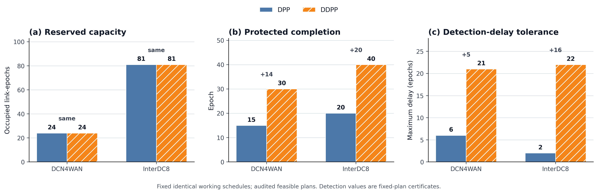
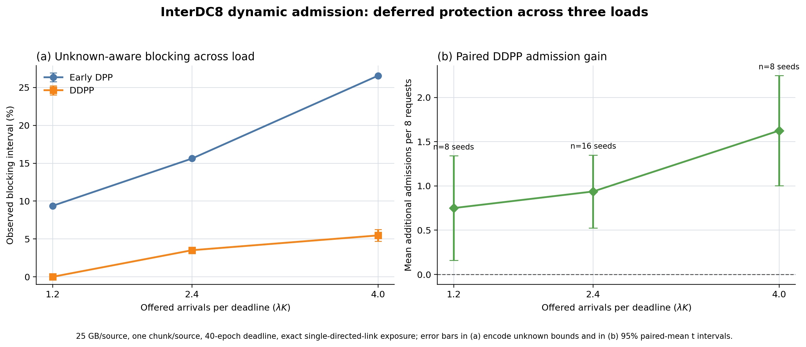
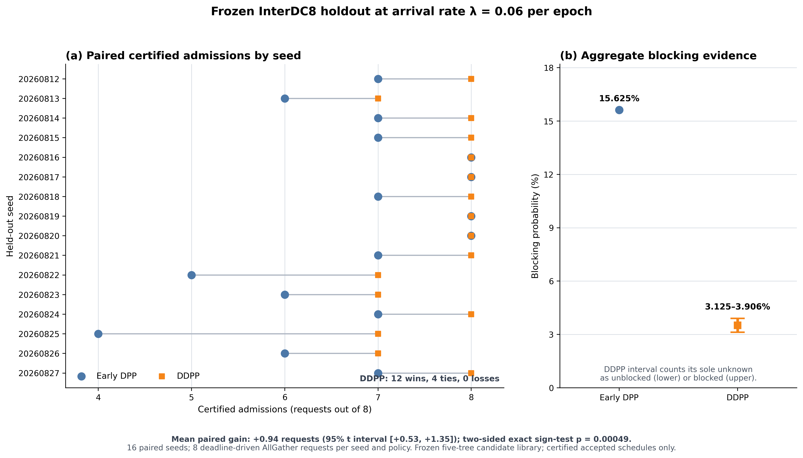

# Experimental Evaluation

> **Draft status:** thesis-ready English draft based on the current certified
> artifacts. Citation keys and chapter/figure numbers are placeholders. The
> principal repeated performance evidence covers three predeclared InterDC8
> loads; DCN4WAN is used as a second-topology correctness and calibration case.

## 1. Evaluation Objectives

The evaluation addresses two questions.

1. Can the strict rooted working-tree/backup-tree formulation produce valid
   protected AllGather schedules under the stated single-directed-link failure
   model?
2. Across lower, transition, and higher InterDC8 loads, does deferring backup
   reservations improve online admission relative to an early-reservation DPP
   baseline?

The first question validates the model and its implementation. The second is
the principal performance question. These roles are kept separate: a
single-request protection certificate establishes correctness and explains
the timing mechanism, whereas request blocking is measured only in the online
multi-request experiment.

## 2. Implementation and Experimental Controls

The prototype extends TE-CCL's time-expanded integer multi-commodity-flow
formulation with strict multicast tree pairs, scenario-robust backup
reservations, and an online residual-capacity ledger. Mixed-integer programs
are solved with Gurobi. A schedule is counted as accepted only after an
independent serialized-schedule audit verifies tree structure, terminal
coverage, directed-link disjointness, capacity, deadline completion,
reservation binding, failure avoidance, and detection timing.

Solver optimality is not required for an admission decision. A feasible
incumbent returned at the time limit is accepted only if it passes every audit.
Conversely, a request is classified as blocked only when the unrestricted
joint tree-and-timing model returns `INFEASIBLE`. A timeout without an audited
incumbent is classified as unknown and does not change the ledger. Thus,

```math
N_{accepted}+N_{blocked}+N_{unknown}=N_{arrivals}.
```

For each unrestricted fallback, the Gurobi time limit is 0.01 hours (36
seconds), the external wall-clock limit is 60 seconds, and the NoRel heuristic
work parameter is zero. Both policies receive the same solver settings. The
implementation bundle used by the held-out experiment has SHA-256 fingerprint
`18a9f894a909c3edcbca9e7a065d1b61d98467227d710718a526c18dedf81847`.

To reduce search cost without changing feasibility semantics, each arrival is
first tested against a frozen five-tree-pair set: one certified topology
template and four additional certified candidates obtained during calibration.
Only transmission timing is reoptimized in these fixed-tree attempts. If all
five candidates fail, the unrestricted model is still run; therefore candidate
failure is never treated as proof of global infeasibility. The library and all
solver settings were frozen before the held-out traces were generated.

## 3. Network Topologies

Two synthetic WAN topologies are used. Their physical link tables are the
source of truth. Each bidirectional physical connection is represented by two
independent directed links of equal bandwidth and propagation delay.

| Topology | Nodes | AllGather participants | Transit nodes | Physical connections | Directed links | Link rates | Propagation delays |
| --- | ---: | ---: | ---: | ---: | ---: | --- | --- |
| DCN4WAN | 9 | 4 | 5 | 16 | 32 | 60--100 Gbit/s | 0.4--1.2 ms |
| InterDC8 | 8 | 8 | 0 | 13 | 26 | 50--100 Gbit/s | 0.5--2.8 ms |

DCN4WAN is a small auditable topology in which four data centers connect
through five copy-capable WAN transit nodes. InterDC8 is the main evaluation
topology: all eight nodes participate in AllGather, and a 50 Gbit/s backbone
plus 60 Gbit/s cross-region bypasses create a meaningful capacity bottleneck.
Neither topology is claimed to reproduce a measured production network.

The physical values are converted once to TE-CCL's internal units:

```math
C_e^{chunk/s}=\frac{C_e^{Gbit/s}}{8B^{GB}},
\qquad
\alpha_e^{s}=\frac{\alpha_e^{ms}}{1000}.
```

## 4. Workload and Failure Settings

Every request is a homogeneous AllGather. Each participating source owns one
indivisible 25 GB chunk, and its chunk must reach every other participant. An
epoch lasts 2 seconds. DCN4WAN uses a 30-epoch relative deadline and InterDC8
uses a 40-epoch relative deadline. The configured failure-detection delay in
the production experiments is one epoch.

The failure model contains one directed link failing at the beginning of an
epoch. A working transmission that started before the failure remains valid;
later starts on the failed link are removed. Surviving working transmissions
continue, and affected commodities recover only through capacity reserved on
their fixed backup trees. The evaluated scope does not include node failures,
simultaneous failures, correlated failures, or failure of both directions of a
physical fiber.

Online arrival gaps are generated as

```math
g_r=\max\left(1,\left\lceil \operatorname{Exp}(\lambda)\right\rceil\right).
```

This discretization permits at most one arrival per epoch. A trace is generated
once for each seed and then reused byte-for-byte by both policies. The main
InterDC8 experiment uses `lambda` values of `0.03`, `0.06`, and `0.10`, eight
requests per seed, and a deadline of 40 epochs. These rates correspond to 1.2,
2.4, and 4.0 offered arrivals per deadline window. The conclusion is
conditional on this trace family and evaluated load range.

## 5. Compared Protection Policies

The baseline is an early scenario-robust multicast tree-pair adaptation of
DPP. It is not presented as literal unicast path-pair DPP 1:1. The comparison
policy is DDPP. Both policies use the same workload, strict tree constraints,
single-link scenarios, detection delay, deadline, candidate library, solver
budget, and audit rules. Their intended difference is reservation timing:

- early DPP places backup opportunities in the early service window;
- DDPP places them in the later remaining-deadline window.

All reservations are computed when a request is admitted. “Deferred” describes
the scheduled position of the reserved link epochs, not delayed planning after
a failure. During an online trace, the two policies may make different earlier
admission decisions and therefore face different residual ledgers later. This
is part of the policy effect, while paired traces maintain a common external
workload.

## 6. Correctness and Mechanism Evidence

### 6.1 Fixed-plan protection trade-off

The single-request certificate covers every directed link at failure epoch
zero and separately sweeps every failure epoch during nominal working
execution. With one-epoch detection delay, all affected cases pass the
independent strict-tree audit. The adjacent detection-delay boundary is also
checked: the analytically derived endpoint is feasible, while the next delay
is proved infeasible at a tight witness.



**Figure X.** Certified resource, completion-time, and detection-delay
properties of the fixed 25 GB one-chunk plans. The values are properties of
these exported plans, not global bounds over all possible plans.

| Topology | Policy | Reserved occupied link-epochs | Protected completion (epochs) | Maximum certified detection delay (epochs) |
| --- | --- | ---: | ---: | ---: |
| DCN4WAN | early DPP | 24 | 15 | 6 |
| DCN4WAN | DDPP | 24 | 30 | 21 |
| InterDC8 | early DPP | 81 | 20 | 2 |
| InterDC8 | DDPP | 81 | 40 | 22 |

Within each topology, the two fixed plans use identical working-tree edges,
backup-tree edges, and total beta-weighted reservation occupancy. DDPP moves
the same reserved resource later and consequently reaches protected completion
later. Its larger numerical detection-delay tolerance means that the later
reserved opportunities remain usable after later notifications; it must not be
interpreted as faster recovery.

### 6.2 Pending failure-semantics sensitivity

An earlier exposure-granularity diagnostic predates the final strict tree-pair
and causal-replay corrections. It is excluded from the current evidence set.
The production experiments use `EXACT` temporal exposure, but no standalone
exposure-count figure is claimed until it is regenerated together with the
stricter occupancy-overlap failure sensitivity. The atomic `(source, chunk)`
protection unit is therefore justified here by the model's indivisible chunk
and in-network-copy semantics, not by the retired diagnostic counts.

## 7. Online Dynamic-Admission Results

### 7.1 Main InterDC8 three-load comparison

The endpoint loads and seeds were frozen in a written experiment plan before
the new traces were generated. The lower and higher loads each contain eight
formal seeds (`20260829`--`20260836`) and 64 requests per policy. A separate
engineering seed (`20260828`) was used only as an integrity gate and is excluded
from all reported statistics. The transition load retains the earlier 16
held-out seeds and 128 requests per policy. No load point or seed was added or
removed after inspecting the policy direction.



**Figure Z.** Unknown-aware observed blocking and paired certified-admission
gain across the three InterDC8 loads. Panel (a) uses intervals only for
solver-unknown outcomes; panel (b) shows 95% paired-mean t intervals. The
endpoint loads use eight seeds and the transition load uses 16 seeds.

| `lambda` | Offered arrivals per deadline | Policy | Accepted | Blocked | Unknown | Blocking interval |
| ---: | ---: | --- | ---: | ---: | ---: | ---: |
| 0.03 | 1.2 | early DPP | 58 | 6 | 0 | 9.375% |
| 0.03 | 1.2 | DDPP | 64 | 0 | 0 | 0% |
| 0.06 | 2.4 | early DPP | 108 | 20 | 0 | 15.625% |
| 0.06 | 2.4 | DDPP | 123 | 4 | 1 | 3.125%--3.90625% |
| 0.10 | 4.0 | early DPP | 47 | 17 | 0 | 26.5625% |
| 0.10 | 4.0 | DDPP | 60 | 3 | 1 | 4.6875%--6.25% |

Observed early-DPP blocking increases monotonically from 9.375% to 15.625%
and 26.5625% as offered load rises. The DDPP upper bounds are 0%, 3.90625%,
and 6.25%. Thus the original transition-load difference is not an isolated
point: DDPP has the lower observed blocking interval at both independently run
endpoint loads as well.

The mean paired DDPP admission gains are 0.75, 0.9375, and 1.625 requests per
eight-request trace from lower to higher load. Their 95% paired-mean t
intervals are `[0.1588, 1.3412]`, `[0.5262, 1.3488]`, and
`[1.0030, 2.2470]`. DDPP records 5 wins, 3 ties, and 0 losses at the lower load;
12 wins, 4 ties, and 0 losses at the transition load; and 8 wins, 0 ties, and
0 losses at the higher load. The corresponding two-sided exact sign-test
values are 0.0625, 0.000488, and 0.0078125. The lower-load sign test does not
cross a 0.05 threshold, so that load is reported as supportive trend evidence
rather than a standalone significance claim.

### 7.2 Detailed transition-load result

The transition-load comparison contains 16 held-out seeds
(`20260812`--`20260827`), eight arrivals per seed, and 128 requests per policy.
Calibration seeds used to build the candidate library are excluded. A
predeclared stopping rule ended the seed expansion after the final batch; no
additional seed was added after observing the statistical result.



**Figure AA.** Unknown-aware blocking and paired certified-admission differences
for the 16 held-out InterDC8 traces at `lambda=0.06`.

| Policy | Accepted | Blocked | Unknown | Blocking interval |
| --- | ---: | ---: | ---: | ---: |
| early DPP | 108 | 20 | 0 | 15.625% |
| DDPP | 123 | 4 | 1 | 3.125%--3.90625% |

For DDPP, the lower endpoint counts only solver-proved infeasible requests and
the upper endpoint pessimistically counts the single unknown as blocked. Thus,
even the conservative DDPP upper bound is below the early-DPP blocking rate.
The absolute reduction is between 11.71875 and 12.5 percentage points, and DDPP
produces 15 more certified admissions in total.

The paired seed outcomes are 12 DDPP wins, four ties, and no losses. The mean
gain is 0.9375 certified admissions per eight-request trace, with a 95% paired
t interval of `[0.5262, 1.3488]`. A two-sided exact sign test over the 12
non-tied seeds gives `p=0.00048828125`. For this evaluated sample, both the
interval and sign test support a positive admission difference; they do not
establish universal dominance on other loads or topologies.

The sole unknown occurs in the DDPP trace for seed `20260813`, request 6. All
five fixed-tree timing attempts were infeasible, but those results cannot prove
global infeasibility. The unrestricted joint model then reached its 36-second
time limit with no incumbent. The request is therefore retained as unknown,
not relabeled as blocked, and makes no ledger mutation.

### 7.3 DCN4WAN calibration

DCN4WAN was also exercised with current-code traces of four, eight, and twelve
requests. In the twelve-request run at `lambda=1.0`, both early DPP and DDPP
accepted all 12 arrivals; no request was blocked or unknown, and both final
ledgers passed the capacity audit. The shorter runs likewise admitted all
requests. These results show that the implementation and ledger operate on a
second topology, but they do not provide evidence of a DDPP performance
advantage because the chosen DCN4WAN workload does not separate the policies.

## 8. Discussion

The results support the intended mechanism. Early backup reservations compete
with the working traffic of temporally nearby requests. Moving the same
protection opportunities toward the deadline changes where that competition
occurs. Moreover, once an atomic source chunk has completed, its future
protection reservation can be safely released. A later DDPP reservation
therefore has a greater opportunity to disappear before its scheduled epoch,
leaving capacity available to subsequent arrivals. Across the evaluated
InterDC8 range, the observed admission gain increases with offered load,
whereas the tested DCN4WAN traces remain below a separating regime.

The evidence also clarifies what DDPP does not provide. It does not reduce the
fixed plans' total reservation occupancy, and it intentionally increases their
protected completion time. The admission benefit arises from temporal
placement and completion-aware release under overlapping online requests, not
from reserving fewer fixed-plan link epochs.

## 9. Validity and Claim Boundary

The current experiment supports the following bounded conclusion:

> Under the evaluated strict multicast tree-pair model, homogeneous 25 GB
> AllGather workload, single-directed-link failure assumptions, and
> discretized-exponential arrival family, DDPP produced fewer blocked or
> unresolved requests than early DPP at all three predeclared InterDC8 loads.
> The paired admission gain remained positive on average and increased from
> 0.75 to 1.625 requests per eight-request trace across the evaluated load
> range. All counted admissions passed the independent protection and capacity
> audits.

The experiment does not establish universal DDPP dominance across every load,
topology, request size, or deadline. It does not model spectrum continuity,
contiguity, or fragmentation in elastic optical networks. It also does not
cover node failures, bidirectional-fiber failures, multiple simultaneous
failures, or hardware execution performance. The repeated blocking evidence
is confined to three loads of one synthetic InterDC8 topology and one arrival
family; the DCN4WAN results are correctness and load-calibration evidence only.

## 10. Reproducibility Artifacts

The chapter is backed by machine-readable reports rather than manually copied
plot values:

- `teccl/examples/results/dynamic_admission_candidate_library_holdout_final_batch/combined_16_seed_summary.json`;
- `teccl/examples/results/dynamic_admission_candidate_library_holdout_final_batch/README.md`;
- `MULTILOAD_EXPERIMENT_PLAN.md`;
- `teccl/examples/results/dynamic_admission_multiload_endpoint_final/interdc8/report.json`;
- `teccl/examples/results/figures/dynamic_admission_multiload/interdc8-three-load-summary.json`;
- `teccl/examples/results/multicast_tree_pair_physical_25gb/README.md`;
- `teccl/examples/results/multicast_tree_pair_physical_25gb/failure_time_sweep/certificate.json`;
- `teccl/examples/results/multicast_tree_pair_physical_25gb/detection_delay_boundary/certificate.json`;
- `teccl/examples/results/dynamic_admission_dcn4wan_current_locator_12req/dcn4wan/rate_1/seed_20260810/report.json`.

Each held-out report retains the serialized trace hash, source-template hashes,
candidate-library hashes, solver status, schedule path, independent audit
result, ledger status, and implementation fingerprint.
